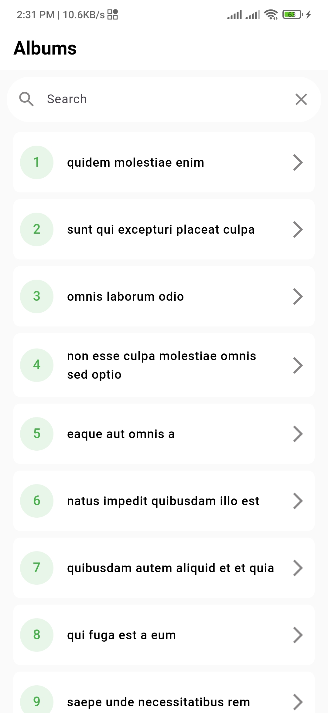

# Flutter Album App

A Flutter application to display albums with pagination and search functionality.

## Features

- Display a list of albums fetched from a REST API
- Pagination to load more albums as you scroll
- Search functionality to filter albums
- Implement a detail view that displays the photos of an album when it is clicked
- Each photo should display a thumbnail and the title.
- Responsive and clean UI design
- State management using GetX

## Apk File Link

[Download the APK](https://drive.google.com/file/d/1htdJnadO1Hb_aaUDX_p2R5o5tBA9qsWS/view?usp=sharing)

## screenshots




## Getting Started

### Prerequisites

- Flutter SDK: [Install Flutter](https://flutter.dev/docs/get-started/install)
- An IDE such as VSCode or Android Studio

### Installation

1. **Clone the repository:**

   ```sh
   git clone https://github.com/zihadsikder/album_task
   cd album_task